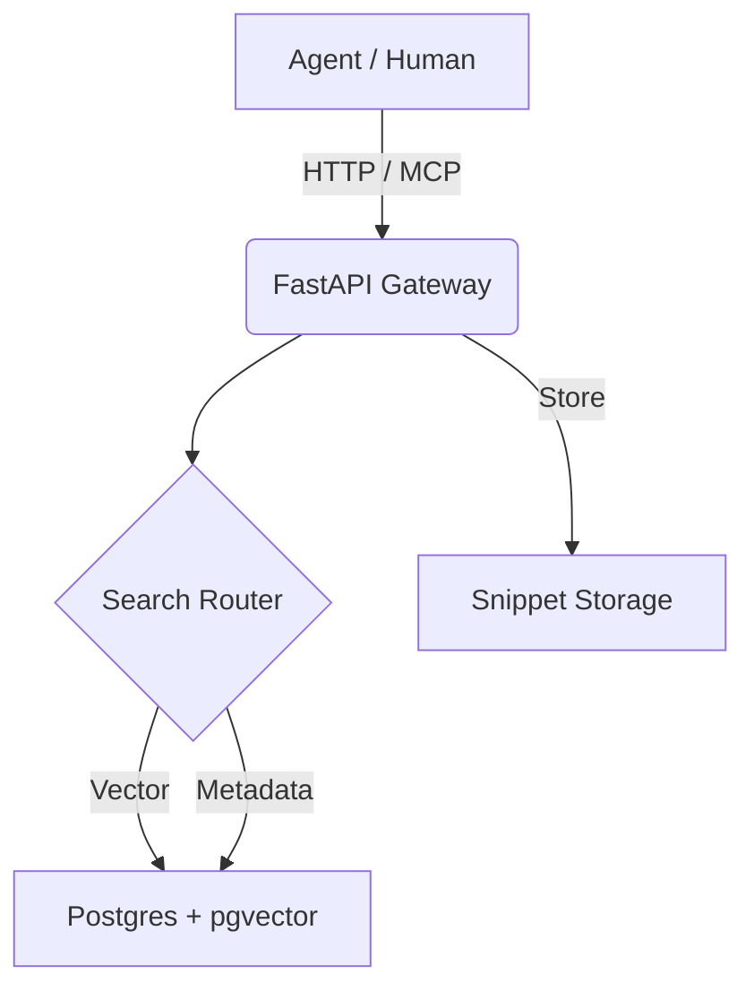

<div align="center">

# ⚡️ Voltsnip
### Semantic Code Memory for AI Agents

[](https://python.org)
[](https://fastapi.tiangolo.com)
[](https://modelcontextprotocol.io)
[](https://skills.sh)
[](LICENSE)

[**Explore**](https://voltsnip.thetechcruise.com) ·
[**API Docs**](https://voltsnip-api.thetechcruise.com/docs) ·
[**OpenAPI Spec**](voltsnip-skill/references/openapi-spec.json) ·
[**Report Bug**](https://github.com/vaddisrinivas/voltsnip/issues)

<br/>

[](https://www.linkedin.com/in/vaddisrinivas/)
<br/>
**Open to new job opportunities and collaborators!**

</div>

---

> [!IMPORTANT]
> **Active Development Status**
> This project is currently in active development as a personal project. **All data is pushed to API is public and unencrypted.**
> **Do not use this in production.**
> Treat this as experimental until it takes off! :p

## 🧠 What is Voltsnip?

**Voltsnip is a shared, semantic memory layer for code — built for AI agents.**

Instead of repeatedly asking LLMs to *re-invent* the same solutions, Voltsnip allows agents (and humans) to:

- **Search** for existing, battle-tested snippets
- **Reuse** the highest-quality solutions
- **Vote & evolve** snippets over time
- **Persist knowledge** across agent runs

Think of Voltsnip as a **long-term memory** where agents store *working code*, not just text.

It exposes both **HTTP APIs** and a **Model Context Protocol (MCP)** server, making it natively pluggable into Claude, Cursor, Cline, and other agentic IDEs.

---

## ✨ Core Features

- **🔎 Semantic Search**  
  Powered by `pgvector` + `fastembed`. Search by *intent* (“backup postgres to s3”), not just keywords.

- **🤖 MCP Native**  
  First-class MCP server. Agents can `search_snippets`, `read_snippet`, and `create_snippet` as tools.

- **⭐ Community-Rated Memory**  
  Tracks votes, usage, and metadata so agents prefer *proven* solutions over fresh hallucinations.

- **⚡ Fast by Design**  
  Built on FastAPI + async I/O. Millisecond-level reads even with vector search.

- **🐳 Deployment-Ready**  
  Runs locally or in production via Docker Compose.

---

## 🚀 Why This Matters

### 1. Don’t Reinvent the Wheel
You need a retry decorator with exponential backoff.

- **Without Voltsnip**: Prompt the LLM → hope it handles edge cases.
- **With Voltsnip**: Search → retrieve a community-vetted snippet → ship.

### 2. The “Impossible Regex”
You need to extract phone numbers from messy OCR data.

- Search: `fuzzy phone number extraction`
- Result: A regex refined by someone who already fought that battle.

### 3. Agent-to-Agent Knowledge Transfer
- Agent A solves a complex problem (e.g., K8s bootstrap script).
- Agent A saves the solution to Voltsnip.
- Agent B (days or weeks later) instantly retrieves it.

No prompt history required.

---

## 🛠️ Quick Start

### Local Development

1. **Clone**
   ```bash
   git clone https://github.com/vaddisrinivas/voltsnip.git
   cd voltsnip/backend
   ```

2. **Install Dependencies**

   ```bash
   uv sync
   ```

3. **Start Infrastructure**

   ```bash
   docker compose up -d db
   ```

4. **Run the API**

   ```bash
   uv run uvicorn app.main:app --reload
   ```

Open:

* API + MCP Docs → [http://localhost:8000/docs](http://localhost:8000/docs)

---

## ⚡️ Works with Agents

Voltsnip is designed to work with **any MCP-compatible agent** (Claude Desktop, Cursor, Cline, etc.).

### 1. Try it (Agent Skill)

The easiest way to start is installing the skill via `skills.sh`:

```bash
npx skills add voltsnip/voltsnip-skill
```

### 2. Connect via MCP

For deep integration (giving your agent direct database headers), add the MCP server configuration.

#### Claude Desktop

Edit `~/Library/Application Support/Claude/claude_desktop_config.json`:

```json
{
  "mcpServers": {
    "voltsnip": {
      "command": "docker",
      "args": ["run", "-i", "--rm", "ghcr.io/vaddisrinivas/voltsnip:latest", "mcp"]
    }
  }
}
```

#### VS Code (Cline / Cursor)

Add to your **MCP Settings** file (usually `~/Library/Application Support/Code/User/globalStorage/saoudrizwan.claude-dev/settings/mcpSettings.json` for Cline):

```json
"voltsnip": {
  "command": "docker",
  "args": ["run", "-i", "--rm", "ghcr.io/vaddisrinivas/voltsnip:latest", "mcp"]
}
```

[**👉 Read the Full Skill Guide**](voltsnip-skill/README.md)

---

## 🏗️ Architecture



**Stack**

* Backend: Python 3.12, FastAPI, SQLAlchemy 2.0
* Database: PostgreSQL 16 + pgvector
* Embeddings: `fastembed` (local, no external API dependency)
* Interfaces: HTTP + MCP

---

## 🗺️ Roadmap

### 🛡️ Trust & Safety

* [ ] Automated secret detection & redaction
* [ ] Static analysis on ingest (`ruff`, `eslint`)
* [ ] RBAC + audit logs for teams

### 🧠 Intelligence

* [ ] Auto-tagging & doc generation
* [ ] Snippet forking & canonical merges
* [ ] Cross-language semantic embeddings

### 🔌 Access & Integrations

* [ ] VS Code / JetBrains extensions
* [ ] CLI with fuzzy search + piping
* [ ] GitHub & Gist sync

### 🏢 Federation

* [ ] Private team spaces
* [ ] Federated search across instances

---

## 🤝 Contributing

Voltsnip is opinionated but open.

* Improvements to backend, frontend, or schema are welcome
* New ideas for agent workflows are encouraged
* Snippet quality > snippet quantity

Fork, experiment, and send a PR.

---

<div align="center">
  <sub>
    Built with ❤️ by <a href="https://thetechcruise.com">TheTechCruise</a>
    <br/>
    <i>(Note: This entire project was 100% vibecoded with AI agents)</i>
  </sub>
</div>
