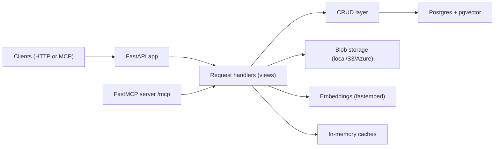
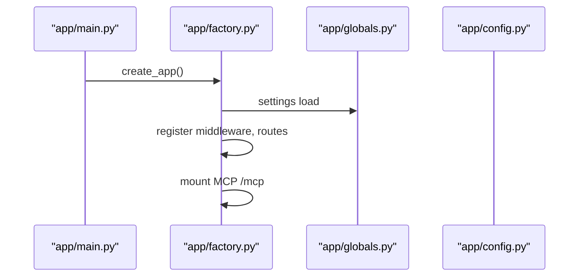
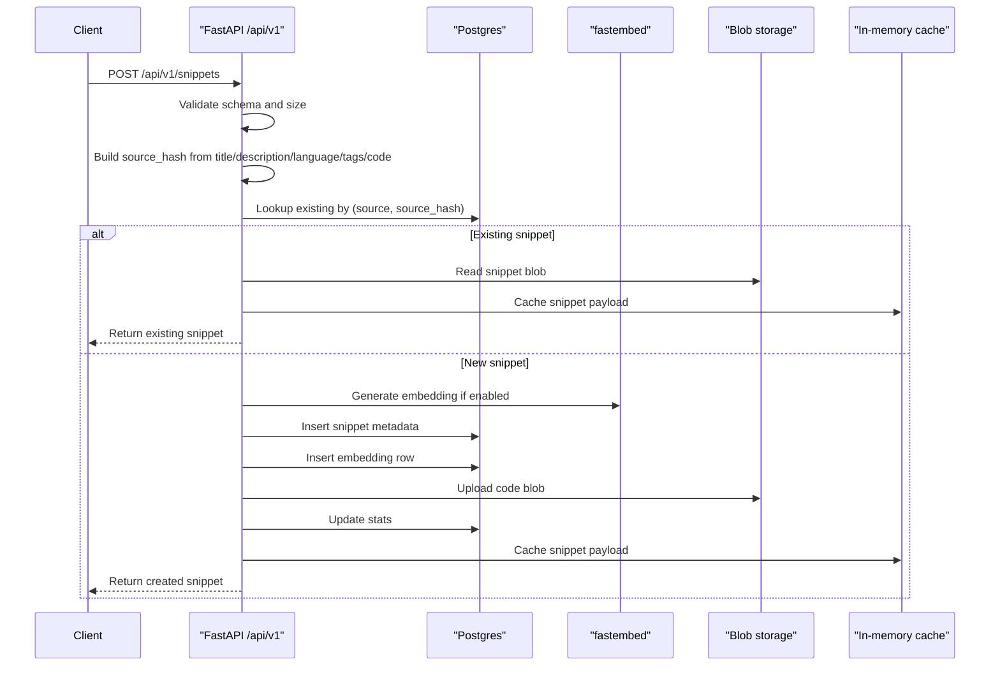
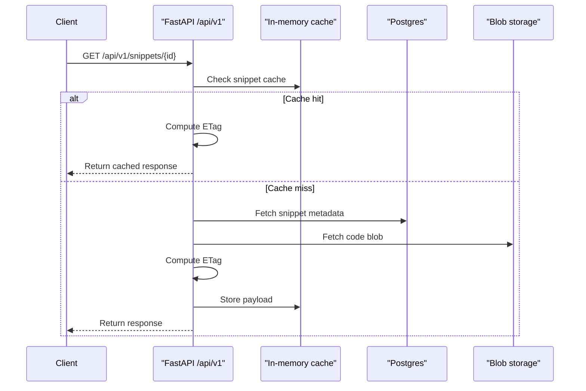
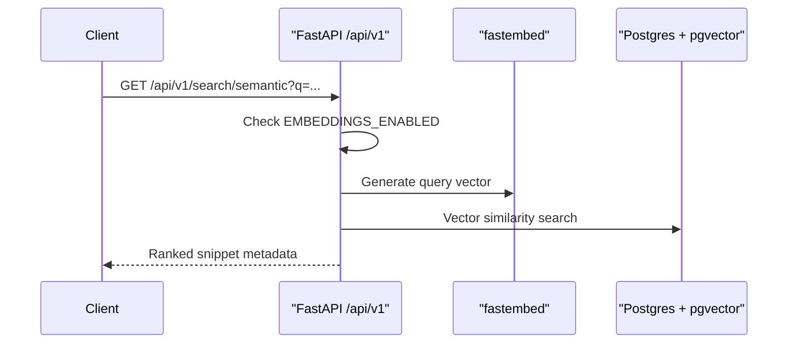
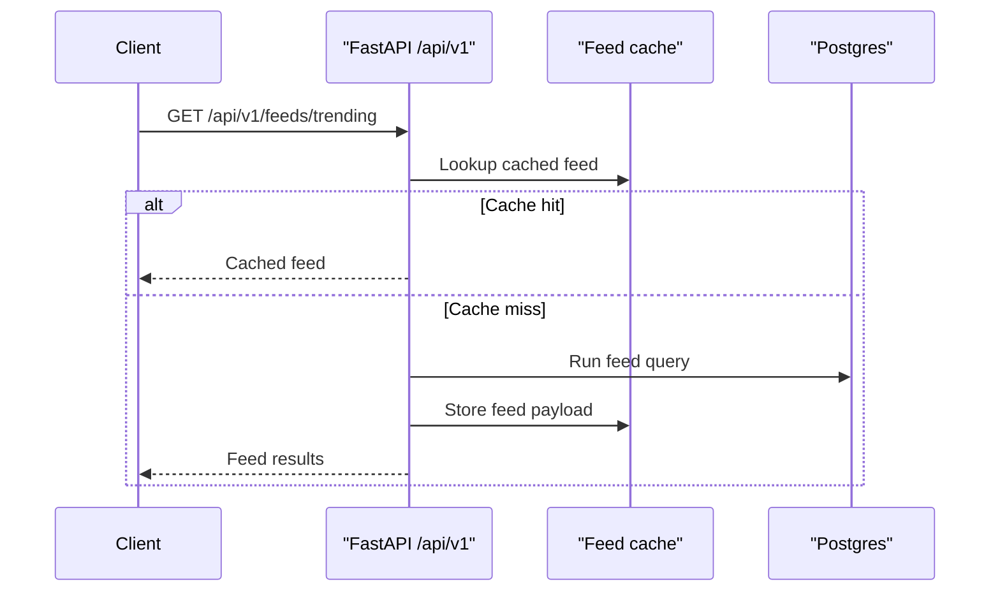

# VoltSnip Backend

This backend powers VoltSnip’s HTTP API and MCP server. It stores snippet metadata in Postgres, snippet content in blob storage, and semantic embeddings in pgvector for intent-based search. The API is built on FastAPI and exposes both REST and MCP resources.

**Endpoints**
- Local HTTP docs: `http://localhost:8000/docs`
- Local OpenAPI: `http://localhost:8000/openapi.json`
- Local MCP: `http://localhost:8000/mcp`
- Hosted HTTP docs: `https://voltsnip-api.thetechcruise.com/docs`
- Hosted MCP: `https://voltsnip-api.thetechcruise.com/mcp`

## System Overview

**High-level architecture**


**Runtime initialization**


## HTTP API Surface

**Route groups**
- `/api/v1/search` for filtered and semantic search
- `/api/v1/snippets` for snippet CRUD and engagement
- `/api/v1/feeds` for hot/trending/top/most-used feeds
- `/api/v1/stats` for global counters
- `/health` for readiness

**MCP surface**
- Mounted at `/mcp` and exposes resources defined in `app/factory.py`.

## Request Flow: Create Snippet



**Important details**
- `source_hash` de-duplicates identical submissions for the same source.
- `MAX_CODE_SIZE` is enforced before storage writes.
- Embeddings are generated from title, description, tags, and a truncated portion of code.
- Blob storage is the source of truth for snippet content, not Postgres.

## Request Flow: Read Snippet



**Caching behavior**
- Snippet responses include `ETag` and `Cache-Control`.
- Cache TTL is controlled by `SNIPPET_CACHE_TTL_SECONDS`.
- `SNIPPET_CACHE_MAX_AGE_SECONDS` controls HTTP max-age.

## Request Flow: Semantic Search



## Request Flow: Feeds



## MCP Resource Mapping

The MCP server is created from the FastAPI app and mounted at `/mcp`. Resources are declared in `app/factory.py` and fetch data using the same CRUD + storage services as HTTP.

**Resources**
- `resource://snippets` returns the latest snippets.
- `resource://snippets/by-tag/{tag}` filters by tag list.
- `resource://snippets/by-title/{title}` filters by title substring.
- `resource://snippets/by-language/{language}` filters by language.
- `resource://snippets/{snippet_id}` returns full snippet content with cache support.

## Data Model

**Tables**
- `snippets` stores metadata, counters, status, expiration, and blob references.
- `snippet_embeddings` stores pgvector embeddings tied to snippets.
- `stats` stores global totals for snippets, views, and votes.
- `snippet_references` stores parent/child relationships for derived snippets.

**Core fields**
- `snippets.blob_key` points to the storage object key.
- `snippets.source_hash` is used for deduplication per source.
- `snippet_embeddings.vector` is indexed for ANN search.

## Storage Layer

**Providers**
- `local`: files under `STORAGE_URI` or `local_storage/`.
- `s3`: uses AWS credentials plus `STORAGE_BUCKET_NAME`.
- `azure`: uses `AZURE_STORAGE_CONNECTION_STRING` plus `STORAGE_BUCKET_NAME`.

**Blob format**
- Snippet code is stored as UTF-8 text under `blob_key` (default `UUID.txt`).
- Metadata is stored in Postgres, not in blob storage.

## Embeddings

- Embeddings are generated using `fastembed`.
- Model name is configurable by `EMBEDDINGS_MODEL_DEFAULT`.
- On failure, embeddings are skipped and the snippet is still stored.
- Semantic search is disabled when `EMBEDDINGS_ENABLED` is false.

## Caching

**In-memory caches**
- `stats_cache` for `/api/v1/stats`.
- `feed_cache` for feeds endpoints.
- `snippet_cache` for snippet reads and MCP resource reads.

**Notes**
- Caches are per-process and not shared across pods.
- Cache TTLs are set via settings constants.

## Security and Gateway

**Gateway enforcement**
- If `VOLTSNIP_GATEWAY_SECRET` is set, the API expects header `X-Gateway-Secret`.
- `GET /health`, `/docs`, and `/openapi.json` bypass the gateway.

**CORS**
- `CORS_ORIGINS` supports `*`, comma-separated lists, or a JSON list.

## Configuration

All configuration is loaded from environment variables using `pydantic-settings`.

**Core settings**
- `DATABASE_URL`: Async SQLAlchemy URL.
- `STORAGE_PROVIDER`: `local`, `s3`, or `azure`.
- `STORAGE_BUCKET_NAME`: Storage bucket or container name.
- `STORAGE_URI`: Local storage root (optional).
- `STORAGE_ENDPOINT`: Optional S3-compatible endpoint.
- `AWS_ACCESS_KEY_ID`, `AWS_SECRET_ACCESS_KEY`, `AWS_REGION`: S3 credentials.
- `AZURE_STORAGE_CONNECTION_STRING`: Azure blob connection string.
- `VOLTSNIP_GATEWAY_SECRET`: Gateway header value.
- `EMBEDDINGS_ENABLED`: Toggle embedding generation.
- `STATS_ENABLED`: Toggle stats collection.
- `MAX_CODE_SIZE`: Max snippet size in bytes.
- `MAX_TAGS`: Max tags allowed per snippet.
- `MAX_SEARCH_K`: Max semantic search `k`.
- `EXPIRATION_HOURS`: Default snippet TTL.
- `TRENDING_WINDOW_HOURS`: Trending lookback window.
- `TOP_FEED_WINDOW_HOURS`: Top feed lookback window.
- `FEED_CACHE_TTL_SECONDS`: Cache TTL for feeds.
- `SNIPPET_CACHE_TTL_SECONDS`: Cache TTL for snippet payloads.
- `SNIPPET_CACHE_MAX_AGE_SECONDS`: HTTP `Cache-Control` max-age for snippet reads.

## Code Map

**Main entry**
- `app/main.py` selects uvloop (non-Windows) and creates the app.

**App creation**
- `app/factory.py` registers middleware, routes, and MCP resources.

**Handlers and logic**
- `app/views.py` implements HTTP handlers and uses CRUD + storage.
- `app/crud.py` encapsulates DB queries and updates.

**Data layer**
- `app/models.py` defines ORM models and indices.
- `app/schemas.py` defines request/response schemas.
- `app/database.py` provides the async session.

**Infrastructure**
- `app/services.py` implements storage and embeddings services.
- `app/cache.py` provides cache helpers.
- `app/globals.py` wires settings, caches, and DB engine.

## Local Development

```bash
cp .env.example .env
uv sync
docker compose up -d db
uv run alembic upgrade head
uv run uvicorn app.main:app --reload
```

## Deployment Notes

- The backend is stateless; scale horizontally with shared Postgres and blob storage.
- In-memory caches are per-instance; for multi-node setups, rely on DB consistency and HTTP caching.
- For a public instance behind a gateway, set `VOLTSNIP_GATEWAY_SECRET` and enforce it at the edge.
